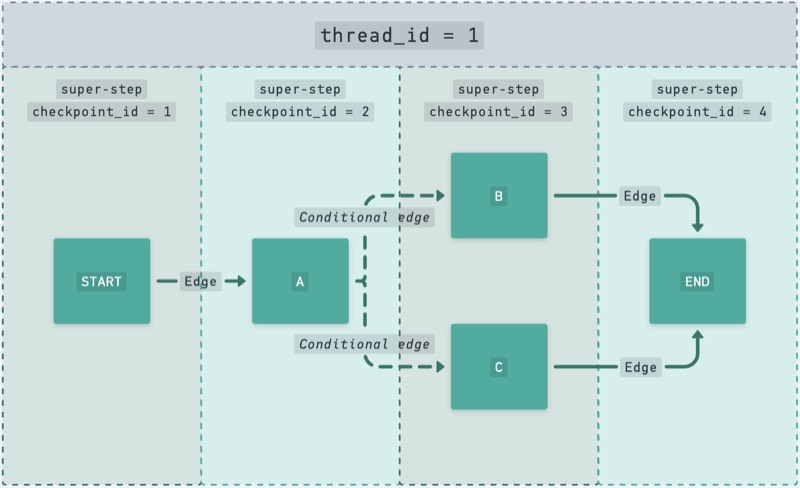

# Checkpointers e Snapshots

Um checkpointer disponibiliza uma camada de persistência de dados para o grafo,
por isso precisamos de algum serviço para salvar esses dados (base de dados,
arquivo ou outro tipo de serviço).

A cada **super-step**, o checkpointer salva um Snapshot do estado naquele ponto
do tempo.

Isso nos permite fazer _Time Travel_, _Human-in-the-loop_, ter histórico de
conversas, tolerância a falhas, fazer fork de conversas e executar várias outras
ações que desejarmos relacionadas aos chats passados e futuros.

Um checkpointer é identificado por dois atributos importantes, o `thread_id` e o
`checkpoint_id`. Em uma conversa identificada por um único `thread_id`, são
criados vários checkpoints, cada um com o seu próprio ID.

Exemplo:



A cada execução do grafo, novos checkpoints são salvos na base de dados e é
possível usar apenas a config inicial do grafo com o mesmo `thread_id` para
obter todo o histórico de conversas. Porém, também é possível usar a combinação
de `thread_id` com `checkpoint_id` para usar algum checkpoint específico no
histórico.

As funções do grafo `get_state` e `get_state_history` podem ser usadas para
obter snapshots do histórico para uma Thread. `get_state` retorna o último
snapshot com todas as mensagens, já `get_state_history` retorna uma lista
contendo todos os snapshots disponíveis.

Já existem alguns checkpointers prontos para o LangGraph, como `InMemorySaver`,
`SqliteSaver` e `PostgresSaver`. Para versões assíncronas temos
`AsyncSqliteSaver` e `AsyncPostgresSaver` (`InMemorySaver` também pode ser usado
em código assíncrono).

---

## Instalação dos checkpointers

O LangGraph disponibiliza os pacotes para os checkpointers mais usados, como
`memory` (não recomendado para produção), `sqlite` e `postgresql`.

Para SQLite e PostgreSQL, precisamos instalar os pacotes do que queremos usar:

```bash
# PostgreSQL
# Se você ver algum erro sobre esses pacotes, basta instalar:
# psycopg[binary], psycopg ou psycopg[c]
uv add "psycopg[binary]" # no meu caso, só precisei de psycopg[binary]
uv add langgraph-checkpoint-postgres

# SQLite
uv add langgraph-checkpoint-sqlite
uv add aiosqlite # se for usar AsyncSqliteSaver
```

Você pode usar `sqlite` em produção, mas a recomendação é usar PostgreSQL para
soluções mais escaláveis e assíncronas.

---

## Na aula 11

Na aula 11 (em vídeo), vou te mostrar como configurar checkpointers de uma forma
desacoplada, para que você possa conseguir usar sua conexão de base de dados
para outras partes da sua aplicação. Além disso, vamos usar o conceito de
Lifespan da aula anterior para garantirmos que nossas conexões serão fechadas
mesmo que ocorra um erro no meio do grafo.

O código está em:

- [../src/examples/ex011](../src/examples/ex011)

---
